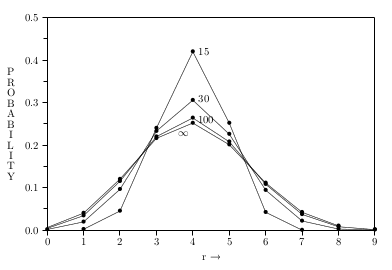

# Plausible Reasoning


## Proof of 1.13

if $\overline{B} = AD$ then $A\overline{B}=\overline{B}$:

$\overline{B} = AD$

$A\overline{B} = AAD$

$A\overline{B} = AD$

$A\overline{B} = \overline{B}$ 

$\square$

if $\overline{B} = AD$ then $B\overline{A}=\overline{A}$:

$\overline{B} = AD$

$A+\overline{B} = A+AD$

$A+\overline{B} = A$ 					using [absorption laws](https://proofwiki.org/wiki/Absorption_Laws_(Boolean_Algebras)), which can be proved with a truth table

$\overline{A}B = \overline{A}$

$\square$


## Markdown Example equations and symbols

inline equations are created within dollar signs, and supports latex syntax  $\overline{AB} = \overline{A} + \overline{B}$


$$A \implies B$$  

$$f_1(A) \uparrow$$  

### Exercise 2.1

$$w(x) \equiv \exp{ \left\{ \int \frac{dx}{H(x)} \right\} } \tag{1.3}$$ 

$$a^2 + b^2 = \sum^\infty_{i=1}\text{somefunction}(c_i^2)$$

----

$$\binom{n}{x}$$  or $$n \choose x$$  

$$P(X | Y)$$ 

----


#### Some code

```python
for i in range(5):
	print(i)
```


###### Images

